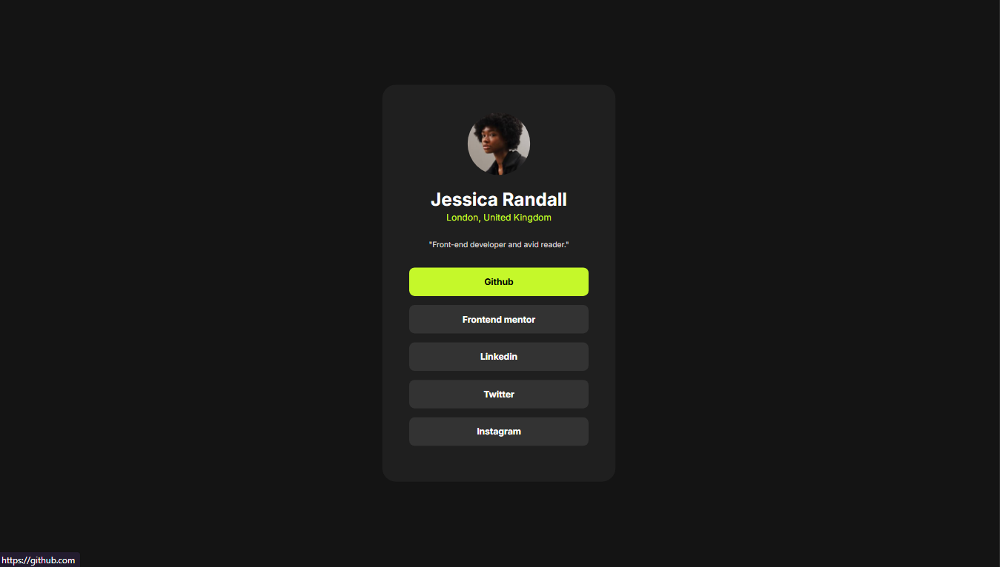

# 🌐 Social Links Profile Card | Tarjeta de Enlaces de Perfil

## 📌 Descripción | Description

Este es un reto del sitio [Frontend Mentor](https://www.frontendmentor.io) donde se debe construir una tarjeta de perfil con enlaces a redes sociales. El objetivo principal es replicar el diseño proporcionado y practicar habilidades de HTML y CSS.

This is a challenge from [Frontend Mentor](https://www.frontendmentor.io) where you must build a profile card with social media links. The main goal is to replicate the given design and practice HTML and CSS skills.

## 🧰 Tecnologías utilizadas | Technologies used

- HTML5
- CSS3
- Google Fonts (Inter)
- Responsive Design

## 🎯 Funcionalidades | Features

- [x] Diseño responsive / Responsive design  
- [x] Estilos de hover y focus en los botones / Hover and focus styles for buttons  
- [x] Layout centrado y estético / Centered and aesthetic layout  

## 📷 Captura de pantalla | Screenshot

